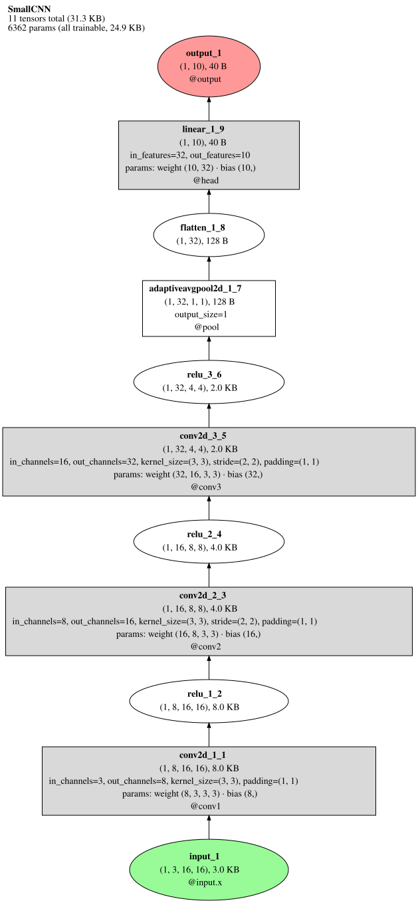
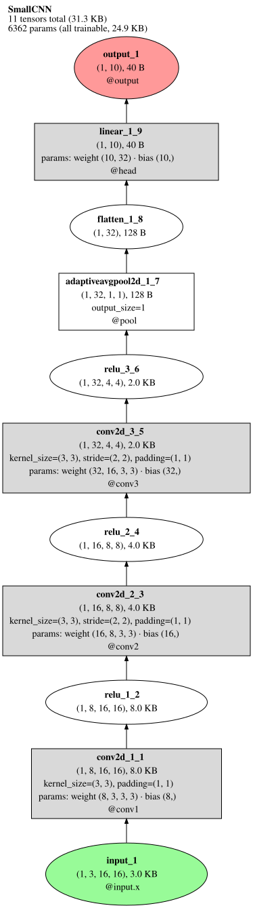
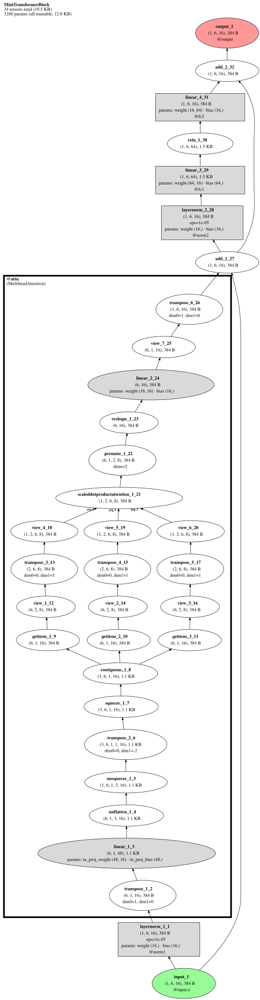
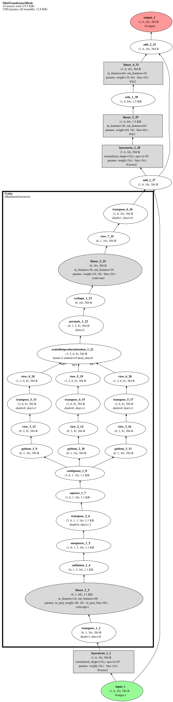
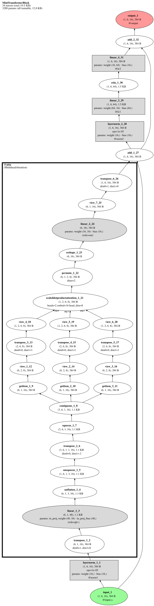

# Node labels and encoding channels

> Every spelling on this page is **documented-unstable** (keyword-only; no
> deprecation shim owed) pending naming-session ratification.

All images under `docs/images/encoding/` are regenerated by
`python scripts/render_encoding_reference.py`.

## Across-pass shape summary row

A rolled multi-pass layer whose passes vary in output shape carries
`Layer.shape_summary` (L1's derived field: `"4->2"` monotone, `"4-2"`
min-max, full `first->last` shapes for multi-axis variation). When set, the
default node label renders it VERBATIM as one plain-text row directly after
the title row, escaped by the standard choke point. Single-pass layers and
unrolled per-pass nodes carry no summary row. The `node_label_fields`
selector token `"shape_summary"` adds the row to explicit field pickers
(skipped when the field is unset).

## Checked suppression of redundant constructor args (default-on)

Node labels omit a module constructor arg exactly when the **check licenses
it**: the arg value provably equals the captured shape dimension it claims
to duplicate *on this trace*. `in_features=32, out_features=10` on a Linear
whose input/output rows already show `(1, 32) -> (1, 10)` says nothing the
label does not already say — so it is suppressed. A **mismatch or an
unavailable shape keeps the arg visible**: the mismatch case is exactly the
interesting one, so the rule can only reveal more, never hide a
discrepancy.

- Eligibility is a **closed table of torch nn module families** (linear
  in/out_features, conv in/out_channels, batch/instance-norm num_features,
  layernorm normalized_shape, embedding embedding_dim, MHA embed_dim).
  Axis semantics are the PyTorch module contract (channel = logical axis 1;
  `channels_last` is a memory format, not a logical shape change).
- **Never candidates** (not recoverable from I/O shapes): kernel_size,
  stride, padding, dilation, groups, num_embeddings, num_heads, dropout p.
- Input-side rows check the **single** incoming data edge's source shape;
  multi-input or shape-less parents stay visible. Non-torch backends and
  unrecognized modules are never candidates. Ambiguity never suppresses.
- A rolled multi-pass aggregate whose passes disagree on shape has no
  single output shape, so its args stay visible while the unrolled per-pass
  nodes suppress — a deliberate, honest cross-mode difference.
- Detached/standalone records render **all** args (no trace to check
  against).

`draw(show_redundant_args=True)` shows every captured arg.

Before/after (conv):

Before/after (transformer block):

Before/after (attention node_style):

